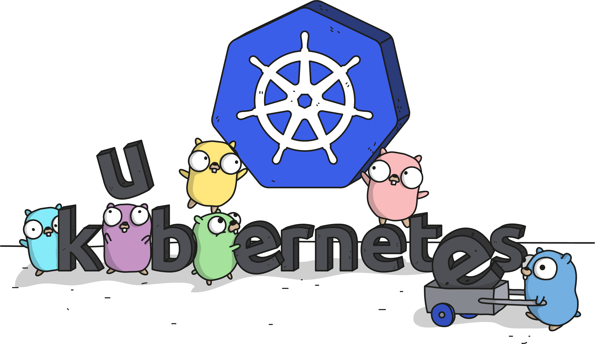

How did I learn Kubernetes and how could you jump start the learning? Here's a list of articles and blogs that would help you step ahead in the game and get learning about kubernetes. I had hard time accumilating and going through documents. Hence the curated list of articles which I feel are really cool and will help you with the [kubernetes learning journey](https://www.linkedin.com/pulse/kubernetes-yeah-go-ravi-kiran-m/).

---

